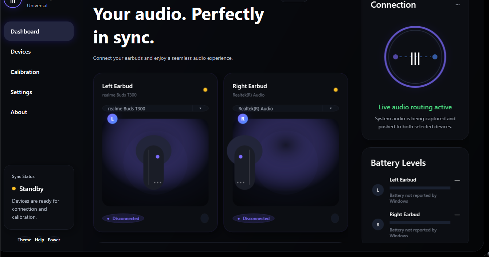
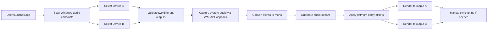
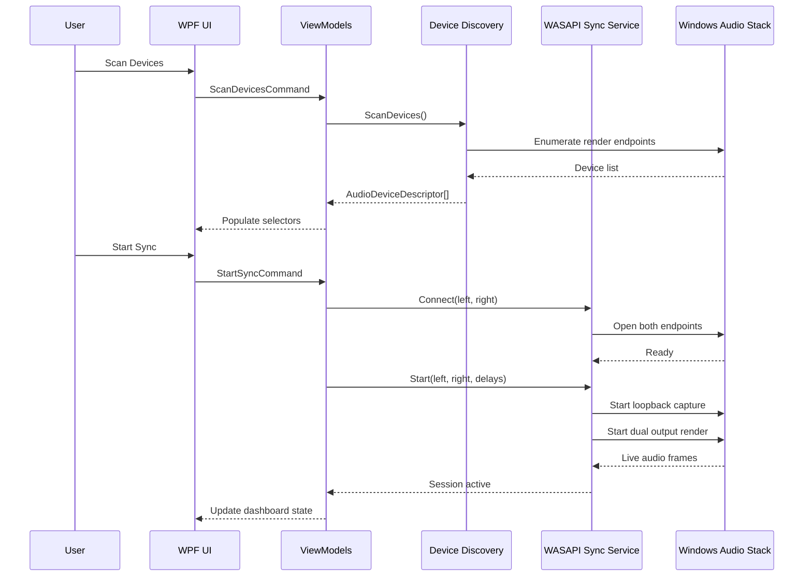
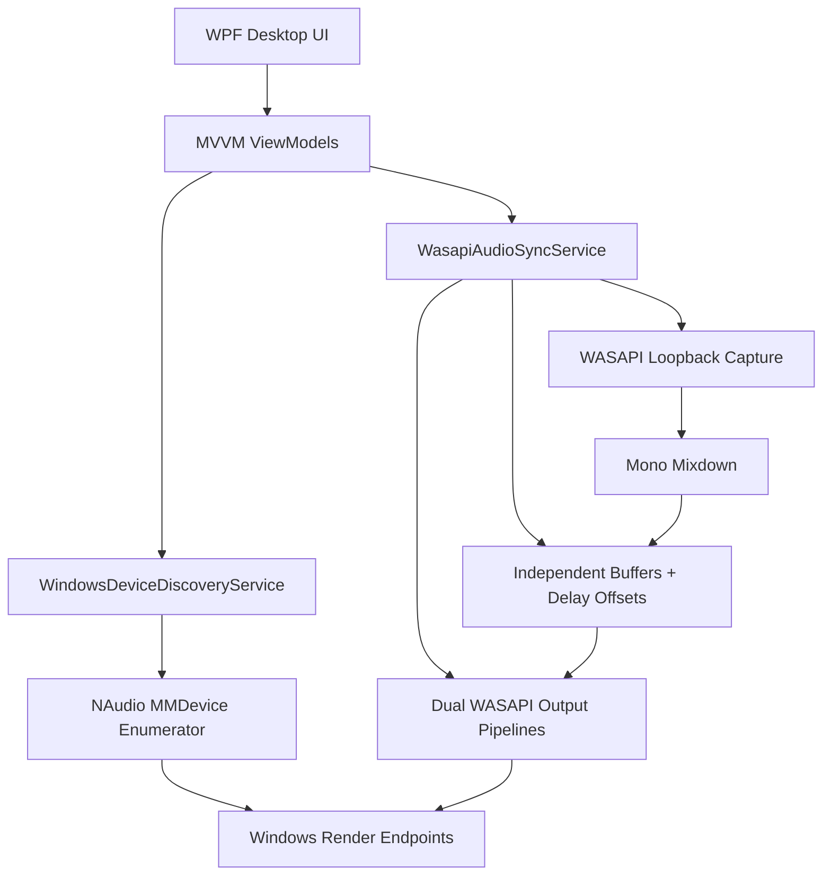

# Universal TWS Sync

Universal TWS Sync is an experimental Windows desktop app for routing the same system audio to two separately paired audio devices and aligning them with manual latency correction.

It is built as a practical proof-of-concept for a simple idea:

> if someone has two unmatched earbuds or two single surviving audio devices, they should still be usable together.

## Preview



## Why This Exists

True wireless earbuds are usually locked to their original pair. If one earbud is lost or damaged, the remaining one often becomes useless.

Universal TWS Sync focuses on:

- reducing e-waste
- extending the life of partially usable earbuds
- enabling cross-device audio reuse on Windows
- proving a realistic dual-endpoint sync workflow before chasing perfect stereo

## Core Capabilities

| Capability | What it does |
| --- | --- |
| Dual endpoint selection | Pick two Windows-visible audio render devices |
| Live system audio capture | Uses WASAPI loopback to read current desktop audio |
| Mono duplication | Downmixes stereo and sends the same stream to both outputs |
| Manual latency correction | Lets users shift one side to reduce echo/desync |
| Session controls | Scan, connect, start sync, stop sync, recalibrate, and test audio |
| Real-time dashboard | Visual status for connection, sync activity, and battery reporting |

## How It Works



## Real-Time Sync Pipeline



## Architecture



## Dashboard Highlights

- `Left Earbud` and `Right Earbud` are treated as two independent output nodes.
- `Scan Devices` reads Windows-visible render endpoints rather than pretending to pair devices directly.
- `Synchronization` is centered around manual latency correction because that is the most reliable MVP control.
- `Connection` reflects session state from the live sync engine.
- `Battery Levels` show real telemetry when Windows exposes it, and gracefully fall back when it does not.

## Current Repository Status

### Implemented now

- WPF desktop application shell
- dark dashboard UI
- real Windows audio endpoint discovery
- WASAPI loopback capture path
- dual-output render attempt through NAudio/WASAPI
- manual delay offsets
- connection, sync, and calibration state handling

### Still experimental

- hardware compatibility varies by Bluetooth adapter and Windows driver stack
- battery, codec, and signal telemetry are inconsistent across vendors
- some devices appear in Windows but may not be available for stable dual playback
- long-session drift compensation is still an active engineering problem

## Tech Stack

| Layer | Technology |
| --- | --- |
| App UI | C# + WPF |
| Pattern | MVVM |
| Audio APIs | NAudio + WASAPI |
| Device discovery | Windows render endpoint enumeration |
| Target runtime in this workspace | .NET Framework 4.0 |
| Build | MSBuild via `build.ps1` |

## Project Structure

```text
universal-tws-sync/
├─ assets/
│  └─ screenshots/
├─ docs/
│  ├─ ARCHITECTURE.md
│  └─ PRD-MVP.md
├─ packages/
├─ src/
│  └─ UniversalTWSSync.App/
│     ├─ Commands/
│     ├─ Infrastructure/
│     ├─ Models/
│     ├─ Services/
│     ├─ ViewModels/
│     ├─ App.xaml
│     ├─ App.xaml.cs
│     ├─ MainWindow.xaml
│     └─ MainWindow.xaml.cs
├─ build.ps1
└─ UniversalTWSSync.sln
```

## Getting Started

### Prerequisites

- Windows machine with WPF build tools installed
- Visual Studio Build Tools with .NET Framework targeting packs
- Bluetooth or audio hardware exposed as Windows render endpoints

### Build

```powershell
Set-ExecutionPolicy -Scope Process Bypass
.\build.ps1
```

### Run

After a successful build:

```powershell
.\src\UniversalTWSSync.App\bin\Debug\UniversalTWSSync.App.exe
```

## Usage Flow

1. Launch the app.
2. Click `Scan Devices`.
3. Select one output for the left slot and one output for the right slot.
4. Start sync.
5. Adjust latency if you hear echo or mismatch.
6. Recalibrate and retry as needed.

## Known Limitations

- This app does not pair brand-new earbuds directly over Bluetooth.
- It depends on what Windows already exposes as render endpoints.
- Two devices can connect successfully and still drift during playback.
- A device showing in the list does not guarantee stable dual-stream playback.
- True stereo separation is not the MVP target yet.

## Roadmap

- automatic latency estimation
- better drift tracking over longer sessions
- saved device pair profiles
- tested hardware compatibility matrix
- improved diagnostic logging and session reporting
- future native performance layer if profiling proves it is necessary

## Supporting Docs

- [MVP PRD](docs/PRD-MVP.md)
- [Architecture Notes](docs/ARCHITECTURE.md)

## Important Note

Universal TWS Sync is currently best described as a Windows audio experimentation utility, not a universal compatibility guarantee. The product direction is strong, but real-world success still depends heavily on the underlying Windows audio and Bluetooth stack.
